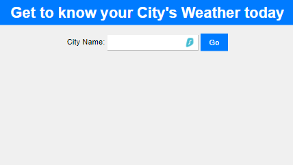

# Weather App

Welcome to the Weather App! This user-friendly application, developed using Node.js, Express.js, and EJS, allows you to input a city name and retrieves real-time weather information through API calls. Experience a seamless and responsive interface on both desktop and mobile devices, delivering up-to-date weather data in an easy-to-understand format.



## Key Features

- **Technology Stack**: Developed using Node.js, Express.js, and EJS.
- **User Input**: Allows users to input a city name.
- **API Integration**: Makes API calls to retrieve real-time weather information.
- **Responsive Design**: Ensures a seamless and responsive user experience on desktop and mobile devices.
- **User-Friendly Interface**: Presents weather data in a user-friendly and easy-to-understand format.

## Technologies Used

- **Node.js**: For the backend runtime environment.
- **Express.js**: As the web application framework.
- **EJS (Embedded JavaScript)**: For templating and generating dynamic HTML.
- **CSS**: For styling the application.
- **JavaScript**: For client-side scripting.

## Getting Started

Follow these steps to set up the Weather App on your local machine.

### Prerequisites

- Node.js (v12.x or later)
- npm (v6.x or later)

### Installation

1. Clone the repository:
    ```bash
    git clone https://github.com/KoustubhSahu/WeatherProject.git
    ```
2. Navigate to the project directory:
    ```bash
    cd WeatherProject
    ```
3. Install the dependencies:
    ```bash
    npm install
    ```
4. Start the application:
    ```bash
    npm start
    ```
5. Open your browser and navigate to `http://localhost:3000`.

## Usage

- **Input City Name**: Enter the name of a city in the input field to get the latest weather information.
- **View Weather Data**: The app will display current weather conditions, temperature, humidity, and other relevant data for the entered city.
- **Responsive Interface**: Enjoy a smooth user experience on both desktop and mobile devices.

## Contributing

Contributions are welcome! If you have suggestions or improvements, please create an issue or submit a pull request.

1. Fork the repository.
2. Create your feature branch:
    ```bash
    git checkout -b feature/AmazingFeature
    ```
3. Commit your changes:
    ```bash
    git commit -m 'Add some AmazingFeature'
    ```
4. Push to the branch:
    ```bash
    git push origin feature/AmazingFeature
    ```
5. Open a pull request.

## License

This project is licensed under the MIT License. See the [LICENSE](LICENSE) file for details.

## Contact

Feel free to reach out with any questions or feedback:
- GitHub: [KoustubhSahu](https://github.com/KoustubhSahu)

---

Thank you for checking out the Weather App! Stay updated with real-time weather information!
